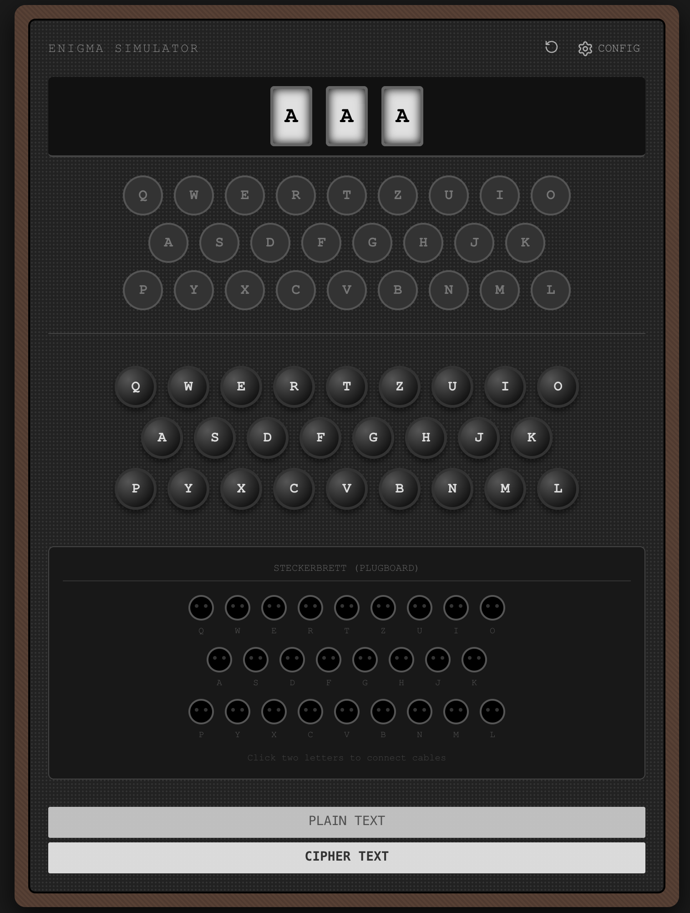

# Documentação do Frontend: Simulador Enigma

Este documento detalha o processo de construção da interface do usuário (UI) para o Simulador da Máquina Enigma. O desenvolvimento foi realizado através de uma abordagem iterativa baseada em prompts, focando em recriar a experiência tátil e visual da máquina eletromecânica original utilizando tecnologias web modernas.

---

## Metodologia de Desenvolvimento

A interface foi "esculpida" passo a passo, separando os componentes lógicos da máquina em seções visuais distintas. Abaixo estão os estágios de desenvolvimento e os prompts conceituais utilizados para gerar cada parte.

### 1. Configurações e Rotores
O primeiro passo foi criar o coração da máquina: o mecanismo de cifragem.

> **Prompt Inicial:**
> *"Crie um componente de cabeçalho que contenha os controles dos Rotores (Walzen). Preciso de 2 slots onde o usuário possa escolher:*
> *1. O tipo de rotor (I, II, III, IV, V).*
> *2. A posição inicial do rotor (Ground Setting - letras A-Z).*
> *O visual deve ser industrial e sóbrio."*

### 2. O Lampboard
A visualização da saída cifrada em tempo real, simulando as lâmpadas incandescentes.

> **Prompt de Estilo:**
> *"Abaixo dos rotores, gere um 'Lampboard'. Organize as letras de QWERTZ em um layout de teclado escalonado. As 'teclas' aqui não são clicáveis; são círculos escuros que, quando ativados (via classe CSS), devem brilhar com um efeito de 'glow' amarelo/alaranjado, imitando uma lâmpada antiga acendendo atrás de um vidro."*

### 3. O Teclado de Entrada
A interface de interação principal do usuário.

> **Prompt de Interação:**
> *"Crie um teclado clicável logo abaixo do Lampboard. O layout deve espelhar exatamente as posições das luzes acima. Ao clicar (mousedown), a tecla deve afundar visualmente e disparar o evento de cifragem. Ao soltar (mouseup), a tecla volta ao normal e a luz apaga."*

### 4. O Plugboard
A parte mais complexa visualmente, responsável pela permutação inicial das letras.

> **Prompt de Complexidade:**
> *"Adicione uma seção de 'Plugboard' na parte inferior. Preciso de uma lista de pares de letras disponíveis. O usuário deve ser capaz de clicar em uma letra e conectá-la a outra, criando um 'cabo' virtual. Visualmente, mostre linhas ou conexões coloridas entre os pares conectados (ex: A <-> Z) e impeça que uma letra seja usada em mais de uma conexão."*

### 5. Display de Texto
Para facilitar a leitura, adicionamos áreas de texto que persistem o histórico, simulando a anotação do operador.

> **Prompt de Layout:**
> *"Ao lado ou abaixo da máquina, coloque dois campos de texto estilo 'display':*
> *1. **Entrada (Plaintext):** Mostra o que o usuário está digitando.*
> *2. **Saída (Ciphertext):** Mostra o resultado cifrado correspondente.*

---

## Demonstração da Aplicação

Abaixo estão capturas de tela do resultado final da interface, demonstrando os diferentes estados da máquina.

### Visão Geral da Interface
*Uma visão completa mostrando os Rotores, Lampboard e Teclado integrados.*

### Configurações
*Foco na configuração dos cabos.*

### Ação de Cifragem e Plugboard
*Demonstração do efeito visual quando uma tecla é pressionada e a letra correspondente se ilumina no Lampboard.*

---

## Tecnologias Utilizadas
A interface foi construída sobre uma arquitetura moderna e tipada, priorizando a robustez do código e a fidelidade visual.

* **React & TypeScript:**
    * Uso de **Hooks** (`useState`, `useEffect`, `useCallback`) para gerenciar o estado complexo da máquina (posição dos rotores, luzes acesas, conexões do plugboard).
    * Tipagem estrita para garantir a integridade dos dados entre a lógica da Enigma (`enigma-core`) e a interface visual.
    * Event Listeners globais (`keydown/keyup`) para permitir a digitação através do teclado físico.

* **CSS3 Avançado:**
    * **Texturas Procedurais:** Uso de `repeating-linear-gradient` e `radial-gradient` para simular as texturas de madeira (caixa) e metal (painel) sem a necessidade de imagens pesadas.
    * **Iluminação Dinâmica:** Uso intensivo de `box-shadow` e `text-shadow` para criar o efeito de brilho incandescente das lâmpadas e a profundidade 3D das teclas pressionadas.
    * **Layout:** `Flexbox` e `Grid` para o alinhamento preciso das teclas no layout QWERTZ alemão.

* **Lucide React:**
    * Biblioteca de ícones leve utilizada para os controles de UI (Configurações, Reset e Fechar).